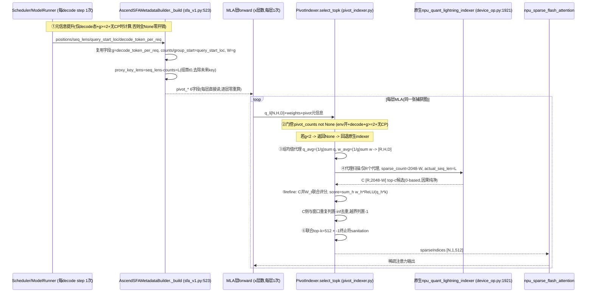

# PIVOT-Refine Indexer 设计文档(修订 v3.4.8)

> 复现论文 [PIVOT: Efficient Query-Group Indexing for Token-Level Sparse Attention](https://arxiv.org/abs/2607.24593)
> 的 PIVOT-Refine 方案,作为原生 SFA indexer 的 decode 路径 drop-in 替换,通过开关控制。
>
> **目标分支:`releases/v0.23.0`(vllm-ascend A5 工作区,当前 checkout = tag `v0.23.0`)。**
>
> **演进脉络见 §0 修订记录**(v1/v2 废弃;v3 修正"组跨步"误断,定型为组均值代理;v3.3 算子化 refine 被 v3.4 推后)。
>
> **本版 v3.4.5 = V1 直通实现(用户决策 2026-08-25)**:代理扫描完全复用原生算子
> (**C∪W 总预算 = 2048** 原生上限:C 宽 = 2048-W,零内核改动,C 不含本步 MTP 新 key);refine 以
> **torch 直通**对 **C∪W_t 联合评分**(W_t 参与竞争,scored 语义)选 **top-k=512**;入图与精度/决定正确优先,
> 算子化 refine 与 c=4096 推后(§8-13)。
> 范围仍为 **decode-only**、落地模型 **GLM-5.2-w4a4c8(C8 FP8 索引器路径)**、
> **原生 SFA 路径**、带 **MTP(g=d+1)** 分组,并完整给出**入图(graph-mode)兼容性分析**。

---

## 0. 修订记录

| 版本 | 变更 |
|---|---|
| v1(废弃) | 含 prefill 设计;坐标误写为 1-based;C8 索引器误判为"回退稠密";无入图分析 |
| v2(废弃) | decode-only;落地 GLM-5.2-w4a4c8 C8 路径;坐标改 0-based;**误断"组内 g 个 query 不共存、组跨步存在"**,并据此设计"主代理 + 跨步候选携带" |
| **v3** | **事实核查纠正**:主验证 forward 内 g 个 query 共存(§3.3),撤回"组跨步"论断;设计改为 **组均值代理(mean-proxy)+ 同 forward 内逐 query refine**,删除跨步候选携带;入图分析随架构更新 |
| **v3.1** | **论文一手证据纠正(附录 B,arXiv:2607.24593 全文)**:①decode 下 C/W 是**并集 `C∪W_t`** 而非"W 预留于 C"(预留是 prefill 规则);②decode 窗口要求 **`W≥g`**(非 g-1),草稿 key 由 W_t 兜底不靠 C("丢草稿 key"表述作废);③**`c=2k=4096` 与 SPARSE_LIMIT=2048 硬顶冲突**,c 上限收紧为 ≤2048;④§4.4 refine mask 修正为逐 query `pos<=positions[q]`;⑤默认 CANDIDATE_COUNT 4096→2048 |
| **v3.2** | **对抗性边界核查(§4.4/§4.6/§5.4 修正)**:**#1** c=k=2048 ⇒ refine 结构上是 no-op(=PIVOT-Reuse+window);**由用户拍板改算子放开 SPARSE_LIMIT/TOPK_MAX_SIZE** 以支持 c=2k=4096(§4.3/V1 记依赖);**#2** refine 对 `C∪W_t` **去重缺失 + `-1` 填充在 gather 前未屏蔽** → 双重计注意力/越界;修正为 **overlap-mask 去重**(图安全,shape 固定;非 torch.unique,其变长输出破坏静态图)+ `pos.clamp(min=0)` 后再 gather(§4.4);**#3** refine 内存 O(N·c·D) 大 batch OOM → 按 chunk 分块(§4.4);**#4** `positions_q` 必须来自 metadata.positions 非 seq_lens(避免早行组员看见未来草稿 key)(§4.4) |
| **v3.3** | **refine 算子化重构(时延最优,用户确认 2026-08-24)**:v3.2 的 refine 是纯 torch einsum(O(c) 打分 + 大 `k_cand`/`[N,H,c]` 物化),**不用算子导致时延剧增**;按用户提议拆成 **no-mask 部分(C)走算子 `sparse_mode=0` + 近期窗口 W_t 永远保留(不评分)**(§4.4)。核实的算子语义:tiling.cpp:173 仅支持 0/3,0=无因果掩码全量扫、3=对角下三角(kernel.h:246-248/223-235)。**C 限制到因果安全域 ⊆[0..L] → no-mask 合法**,compaction 成连续 buffer 后逐 query 用自己 q 打分 → 保留 refine 逐 query 特异性;W_t 右端=query 自身位置、天然不泄漏未来 key,不评分、append 即可。**顺带解决 v3.2 的 op-reuse 阻塞**(W_t 拆出后 C 内部因果安全)。torch 只剩 compaction/remap/merge(纯内存+向量 op,无 matmul)。§8 补 3 条(compaction 成本/≤g+W 槽浪费/window 略偏局部);**V5 静态核查通过(§4.4/§5.4)**:非 PA 约束要求 layout_query==layout_key 且 query 仅支持 BSND/TND ⇒ refine 的 C 打分用 **TND+TND**(非初版设想的 BSND),block_table=None、TND key 连续读、actual_seq_lengths 每请求累计 |
| **v3.4** | **V1 直通(pass-through)回归,用户决策 2026-08-25**:v3.3 的"refine 走算子(TND+TND no-mask)"推后为后续优化;**V1 采纳**:①**C∪W 合并并控制在上限 2048**——代理扫描**完全复用原生调用**(`sparse_count=2048, sparse_mode=3, PA_BSND`,device_op.py:1921 逐字节不变),**零内核改动、不再依赖 §4.3/#1 的 BASE_TOPK 放开**;②**refine 选 top-k=512**——从 C∪W(≤2048)里用 **torch 打分**(`Σ_h w[h]·ReLU(q[h]·k)`,FP8 反量化域)选 top-512,图安全(op 仅用于代理扫描);③**决定正确 = refine 打分公式与算子逐头一致 + C∪W 覆盖真 top-k**(c=4k=2048 余量远大于论文 c=2k)。④"不要求使用算子" = 时延非 V1 目标,算子化 refine(v3.3)与 `c=4096`(§4.3/#1)均推后(§8-13)。**已核查**:原生 C8 调用打分输入全链路(device_op.py:1921-1936 + sfa_v1.py:1549-1551),torch refine 公式与算子同源(§4.4) |
| **v3.4.1** | **C 的未来 key 源头去除(用户指出 2026-08-25)**:代理扫描 key 长度改传 `seq_lens - counts`(counts=每请求实际 query 数,与组均值同源)——对齐论文 Stage 1 的扫描域 `s=1..t0`(t0=组首位置),C ⊆ [0,L-1] 对全组员因果纯净、**零未来 key/零槽浪费**;被排除的组内新 key 由窗口承载(W≥g ⇒ W_t ⊇ [L..t+i],论文如此设计)。同时 §4.4 把因果 mask 挪到 topk **之前**(score 级 -inf,B 兜底)+ 补 `-inf->-1` 卫生化(短前缀合法候选不足 k 时 topk 捞垃圾位置的漏洞)。§8-10-① 的"代理站组末"偏差随之消除;**对算子版意义更大:算子内 topk 融合无法 pre-mask,源头去除是唯一预去除手段**。窗口是否参与打分(scored vs always-keep)另议待用户定默认 |
| **v3.4.2** | **窗口 W_t 参与评分(用户决策 2026-08-25,替代 v3.3 的"永远保留不评分")**:refine 对 **C∪W_t 联合打分、联合 topk(k=512)**,与论文 Eq8-9 的 `s ∈ C ∪ W_t` 整体竞争一致;C 侧与窗口重复列 mask(并集去重),窗口越界列(序列开头)**置 -1 而非 clamp(0)**(v3.3 的 clamp 会造重复位置 0 -> SFA 双重计注意力,已修);输出不再有"前 W 列固定窗口"结构。**后续算子版同为 scored 语义**(§4.4 遗产注/§8-13-b:C∪W* 合并 buffer[W*=组窗口并集,宽 W+g-1]单次 TND+TND no-mask 调用,topk 后按列来源去重/因果 mask)。新增 §8-15 精度风险与回退说明 |
| **v3.4.3** | **两项用户决策(2026-08-25)**:①**C 不含本步 MTP 新 key 再确认为既定语义**--即 v3.4.1 的源头去除(代理扫描 key 长 = `seq_lens - counts`),C ⊆ [0,L-1],MTP 草稿 key 只由窗口带入竞争域(§4.3);②**精简 env**--删 `VLLM_ASCEND_PIVOT_POOLING`(池化固定 = mean,论文组均值,无备选)与 `VLLM_ASCEND_PIVOT_REFINE_CHUNK`(分块粒度改为 `pivot_indexer.py` 模块常量 `_REFINE_CHUNK=256`),envs.py 只 +5 个变量(§4.5/§6) |
| **v3.4.4** | **C∪W 总预算修正为恰 2048(用户决策 2026-08-25,回归其原始表述"将 C 合并 W 控制在上限 2048")**:C 宽 = 2048-W--代理扫描直接传 `sparse_count = 2048-W`(算子接受任意 ≤2048,零内核改动),窗口 W 列并入后**联合候选域恰为 2048**(上一版误写成"C=2048 + W 额外并入 = 2048+W",本版纠正);`VLLM_ASCEND_PIVOT_CANDIDATE_COUNT` 语义改为 **C∪W 总预算**(默认 2048),C 宽 = 该值 - W(§4.2-6/§4.3/§4.5) |
| **v3.4.7(本版)** | **实现期事实核查修正(Step 3 编码反馈)**:①**门控改单点真源**--`_build` 中 PIVOT 元信息是否为 None 本身编码全部门控(env 开 + decode 态 + `decode_token_per_req>=2` + 无 DSA-CP),调用点只判 `pivot_counts is not None`;g<2(普通 decode/草稿迭代)时 `select_topk` 返回 **None 回退原生索引器**(非 raise);②**复用 common_attn_metadata 现成字段**--counts/group_start 由 `query_start_loc` 直接给出(免差分构造),g 直接取 `decode_token_per_req`(=1+spec_token_num,草稿迭代置 1),positions 取 scheduler 权威值;③**PD 场景核查**--PD mixed(chunked prefill 混 decode)attn_state 非 decode 集合、PD 分离 decode 实例等价普通 decode(KV 来源对 PIVOT 透明),均天然不触发或安全;④**graph padding 行卫兵**--按 `num_actual_tokens` 计算、padding 行输出 -1 尾(shape 静态分支,capture 安全,capture 期 N_in==N 不触发) |
| **v3.4.6** | **两项用户决策(2026-08-25)**:①**环境变量再自动化**--删 `VLLM_ASCEND_PIVOT_CANDIDATE_COUNT`(总预算 = 2048 是算子原生上限,固化为 `pivot_indexer.py` 模块常量 `_CANDIDATE_BUDGET=2048`)与 `VLLM_ASCEND_PIVOT_WINDOW_SIZE`(W 恒自动 = g = 草稿数+1,无需配置);envs.py 最终只 +2 个变量(总开关 + topk)。②**派生元信息提升**--`counts/group_start/req_ids/positions_q` 提升到 `AscendSFAMetadata._build` 一次性计算(decode 态才算,其余路径零开销),PIVOT 分支直接读字段,消除 select_topk 内每步重复推导(§6) |
| **v3.4.5** | **两项用户决策(2026-08-25)**:①**删 `VLLM_ASCEND_PIVOT_WINDOW_KEEP`**--scored 联合竞争为**唯一语义,不设回退开关**;envs.py 最终只 +4 个变量。②**语义再确认**:计算 C 时代理扫描**不涉及 W 的 kv cache**(C 宽 = 总预算-W 仅是宽度预算),每个 query 在 refine 时并入**自身**的 W_t -> C∪W_t 联合 -> top-512;W 的 key 只在 query 级出现一次(§4.2-4/§4.4) |
| **v3.4.8** | **新增 §4.1.1 端到端时序图**(用户需求 2026-08-25):Mermaid sequenceDiagram 展示"元信息提升(每步 1 次)-> 每层 PIVOT 分支(代理扫描 + refine)-> SFA 消费"全链路,节点挂 file:line;附**图读法**与 **PPT 半页落地价值素材**(§4.1.1 末) |

---

## 1. 目标与范围

- **唯一目标**:decode 阶段的 indexer 选择流程优化。**不实现 prefill 阶段设计**(用户明确)。
- **落地模型**:GLM-5.2-w4a4c8(模型类型 `glm_moe_dsa`)。带 **C8 FP8 KV cache**(A5 e4m3)。
- **执行路径**:原生 SFA 路径。调用链:
  `AscendSFAImpl.indexer_select_post_process`([sfa_v1.py:1483](A5/vllm-ascend/vllm_ascend/attention/sfa_v1.py#L1483))
  → `DeviceOperator.indexer_select_post_process`([device_op.py:1896](A5/vllm-ascend/vllm_ascend/device/device_op.py#L1896))
  → `torch_npu.npu_quant_lightning_indexer`(C8 分支,device_op.py:1921)。
  **排除** dsa_offload 路径(LIDU 增量索引器):LIDU 是增量 top-K 维护、非全前缀扫描,PIVOT 论文
  算法在结构上不适用;且 `bind_dsa_offload_context` 对 C8 硬拒。
- **投机解码**:带 MTP,decode 分组 g = d + 1(主 token + d 个 MTP draft)。分组落在
  **主模型验证 forward**(§3.3),草稿模型 step-0 与主模型同 batch(§3.3)。
- **开关**:环境变量控制,入图期静态决策。
- **入图要求**:保证可在 aclgraph/cudagraph 下 capture;无法入图的部分要说明理由。

---

## 2. 论文算法回顾(PIVOT-Refine,Algorithm 1 的 decode 部分)

Token-level sparse attention 的 indexer 为每个 query 对**全前缀**打分取 top-k,复杂度 $O(L)$ 每 query。
PIVOT 观察:同一组内相邻 query 的 top-k 高度重叠(最高 ~90%),因此:

```
decode 分组:每组 = 一次 MTP 步中一起解码的 query(论文原话),vLLM 中即主验证
forward 每请求的 g = 1+d 个 query(位置 t..t+d)。组首位置 t。

Stage 1 共享代理扫描(coarse):
  q̄_j = (1/g) Σ_{t∈G} q^I_{t,j}          # 逐头平均组内 query
  w̄_j = (1/g) Σ_{t∈G} w^I_{t,j}          # 逐头平均门控权重
  Ī_s = Σ_j w̄_j ReLU(q̄_j · k^I_s), s=1..t0   # 一次全前缀扫描

Stage 2 逐 query 选择(fine):
  C ← TopK(Ī, c)                        # 共享候选集, c = Top-C = 2×Top-K
  对每个 t∈G:
    I_{t,s} = Σ_j w^I_{t,j} ReLU(q^I_{t,j} · k^I_s), s ∈ C ∪ W_t
    𝒯_t ← TopK({I_{t,s}}, k)            # 各自 top-k
```

- 局部窗口(Appendix B):`W_t = [t-W+1, t]`(含 t 自身)。**decode 要求 `W ≥ g`**(g=d+1),保证窗口覆盖本步新生成的草稿 key。
- **C/W 关系(一手证据,附录 B)**:prefill 下 **C 容量固定为 c,W 预留其中**(`w_g = W+g-1` 槽给窗口并集,代理填 `c-w_g`,两部分拼接总长恒等于 c);**decode 下是并集 `C ∪ W_t`**(本步 C 在组首位置召回、装不下本步刚生成的 key,由窗口并入),去重后大小 ≤ c+W。
- 复杂度:`O(L + gc)`,介于单 query 的 `O(L)` 与逐 query 的 `O(gL)` 之间。
- 默认超参:**`k=512`(V1 refine 输出宽度,用户决策,§4.4/§4.5)**;**`C∪W 总预算 = 2048`**(原生上限,用户决策:C 宽 = 2048-W,代理扫描 `sparse_count=2048-W`);
  论文默认 c=2k,本设计总预算 2048=4k 余量更大;`4096` 是后续性能目标,依赖算子放开 BASE_TOPK(§4.3/#1);`W=g`。

---

## 3. 事实核查(全部有代码/内核依据)

### 3.1 坐标系统:索引器输出为 **0-based 请求内 key 位置**

`npu_lightning_indexer` 输出 `sparse_indices` 是**请求内 0-based 的 key 逻辑位置**。
由 SFA 内核 `GetkeyOffset` 核实(`csrc/attention/kv_quant_sparse_flash_attention/op_kernel/arch35/kv_quant_sparse_flash_attention_service_vector_mla.h:192-214`):`s2Idx < 0` 返回 -1(终止符约定);PA 路径 SFA 内部经 `block_table` 将逻辑位置映射到物理 slot:`slot = block_table[req, pos // blockSize] * blockSize + pos % blockSize`。
(v1 文档误写为 1-based,本版修正;UT 用稠密参考断言坐标约定。)

### 3.2 落地路径与算子(原生 SFA,C8)

- 原生 decode indexer 每步对**全前缀**扫描: `npu_quant_lightning_indexer`(C8)/ `npu_lightning_indexer`,
  `sparse_count=2048`, `sparse_mode=3`, `layout_query="TND"`, `layout_key="PA_BSND"`
  ([device_op.py:1896-1963](A5/vllm-ascend/vllm_ascend/device/device_op.py#L1896))。
  **即当前 SFA top-k k=2048(硬编码 `sparse_count=2048`,[device_op.py:1934](A5/vllm-ascend/vllm_ascend/device/device_op.py#L1934);注意 dsa_v1.py:840 的 `# 512` 注释与本 C8 路径不一致,以 device_op.py 硬编码 2048 为准)。**
- **C8 索引器 K**:`indexer_select_pre_process` 内 `k_li @ k_hadamard` → `npu_dynamic_quant(..., dst_type=float8_e4m3fn)`,
  scale FP32([sfa_v1.py:1475](A5/vllm-ascend/vllm_ascend/attention/sfa_v1.py#L1475));q 侧对称
  (`q_li @ q_hadamard` → quant,[sfa_v1.py:1547-1551](A5/vllm-ascend/vllm_ascend/attention/sfa_v1.py#L1547))。
  Hadamard 正交 `(qH)·(kH) = q·k`,打分域不变;代理均值与 refine 必须**在同一 Hadamard 域**
  用反量化后的 q/K 打分,与算子逐位对齐。
- C8 下 `kv_cache` 布局:`packed_kv_cache = enable_sparse_sfa_c8` 时索引器 K 在 `kv_cache[1]`、scale 在
  `kv_cache[2]`;否则 K 在 `kv_cache[2]`、scale 在 `kv_cache[3]`
  ([device_op.py:1909-1911](A5/vllm-ascend/vllm_ascend/device/device_op.py#L1909))。

### 3.3 MTP decode 流:主验证 forward 内 g 个 query **共存于同一时刻**(组不跨步)

**结论(修正 v2):** 论文的"组内 g 个 query"在 vLLM 流式 MTP 中**共存于主模型验证 forward
的同一次 indexer 调用**。v2 的"组跨步存在"结论是**误归因**,正式撤回。证据链:

1. **主 forward 每请求携带 (1+d) 个 query**:`decode_token_per_req = 1 + spec_token_num`
   ([model_runner_v1.py:633-637](A5/vllm-ascend/vllm_ascend/worker/model_runner_v1.py#L633))。
   scheduler 每请求写 `num_draft_tokens[req] = len(scheduled_spec_decode_tokens[req])`,
   `num_sampled_tokens = num_draft_tokens + 1`
   ([model_runner_v1.py:1315-1340](A5/vllm-ascend/vllm_ascend/worker/model_runner_v1.py#L1315))。
   主 forward batch = R 请求 × (1 + num_draft_tokens[i]) token,**一次 forward、一次 indexer 调用**
   ([sfa_v1.py:1952](A5/vllm-ascend/vllm_ascend/attention/sfa_v1.py#L1952))。
2. **图模式下组大小均匀 = 1+d**:`uniform_decode_query_len = 1 + num_spec_tokens`
   ([utils.py:1183](A5/vllm-ascend/vllm_ascend/utils.py#L1183));cudagraph batch descriptor
   `num_reqs = num_tokens_padded // uniform_decode_query_len` 且
   `assert num_tokens_padded % uniform_decode_query_len == 0`
   ([patch_cudagraph.py:23-24](A5/vllm-ascend/vllm_ascend/patch/worker/patch_cudagraph.py#L23))。
3. **草稿模型 step-0 与主模型处理同一 batch**:`_run_merged_draft` step-0
   `model_input_ids = self.input_ids[:num_input_tokens]`
   ([llm_base_proposer.py:1068](A5/vllm-ascend/vllm_ascend/spec_decode/llm_base_proposer.py#L1068)),
   `num_input_tokens` 即主 forward 的 `num_tokens`(graph 下为 padded 值)
   ([llm_base_proposer.py:795-797](A5/vllm-ascend/vllm_ascend/spec_decode/llm_base_proposer.py#L795));
   metadata 复用主模型的 `common_attn_metadata`
   ([llm_base_proposer.py:820](A5/vllm-ascend/vllm_ascend/spec_decode/llm_base_proposer.py#L820))。
   故**草稿步 0 的 SFA 同样见到 (1+d) query 共存**;草稿步 1..d 才逐次 1 token/请求
   (`num_actual_tokens=batch_size`、`decode_token_per_req=1`
   ([llm_base_proposer.py:1563-1570](A5/vllm-ascend/vllm_ascend/spec_decode/llm_base_proposer.py#L1563))),
   且步 1+ 经 `set_skip_topk(True)` **跳过 indexer**(复用 step-0 结果,
   [llm_base_proposer.py:1100-1102](A5/vllm-ascend/vllm_ascend/spec_decode/llm_base_proposer.py#L1100))。
4. **`spec_actual_seq_lengths_query` 的正确解读**(用户质疑点):这些是**草稿模型**逐草稿步的
   graph-stable 独立缓冲(draft_index 1..d 各一份,
   [sfa_v1.py:287-313](A5/vllm-ascend/vllm_ascend/attention/sfa_v1.py#L287)),仅 dsa_cp 分支使用
   ([sfa_v1.py:434-443](A5/vllm-ascend/vllm_ascend/attention/sfa_v1.py#L434))。
   它们是"**草稿步各有独立前向/独立 metadata**"的证据(构建路径 `build_for_drafting(draft_index)`,
   [sfa_v1.py:357-363](A5/vllm-ascend/vllm_ascend/attention/sfa_v1.py#L357)),**不是**
   "主步组内 query 跨步"的证据。v2 据此推断"组跨步存在"属于**误归因**。
5. **论文依据**:decode 分组定义 = "the queries decoded together in one multi-token prediction
   (MTP) step are grouped together"(arXiv:2607.24593;经 alphaxiv 摘要核实)。vLLM 中"一次 MTP 步"
   即主验证 forward,组内 query 同刻共存 → 论文 mean-proxy 可直接实现。
6. **GLM 系列草稿模型被强制 eager**(v0.23.0 事实,[llm_base_proposer.py:218-234](A5/vllm-ascend/vllm_ascend/spec_decode/llm_base_proposer.py#L218)):
   `_is_glm_model` 命中(GLM-5.2 model_type `glm_moe_dsa` 匹配 "glm",
   [llm_base_proposer.py:139-147](A5/vllm-ascend/vllm_ascend/spec_decode/llm_base_proposer.py#L139))时
   `use_cuda_graph = False` -- 草稿模型(含 step-0)在 GLM-5.2 上**始终 eager**,
   只有主模型可入图。因此 PIVOT 的入图义务只落在**主模型 forward**;
   草稿 step-0 的 PIVOT 路径天然 eager,无 capture 约束。

**设计含义**:不需要"主代理 + 跨步候选携带"。主 forward 内即可:组均值代理 → 一次全前缀扫描 →
对全部 (1+d) query 各自 refine。`indexer_select_post_process` 也无需为区分主/草稿步穿线
`draft_index` -- PIVOT 分支按 metadata 的 PIVOT 元信息是否为 None 判定即可(其编码了
g>=2 + decode 态 + 无 CP;g<2 时 select_topk 返回 None 回退原生索引器),主 forward 与草稿 step-0 共享同一条路径。

### 3.4 图模式机制

- `simple_compile_backend = "eager"`([platform.py:132](A5/vllm-ascend/vllm_ascend/platform.py#L132))
  禁用 `torch.compile`;入图载体是 **cudagraph/aclgraph**(FULL/PIECEWISE)。
- 图 capture 约束:**静态形状、无基于张量值的 Python 分支、无 `.item()/.cpu()/.tolist()` 宿主同步**。
  已知坑:capture 期间宿主同步触发 aclrtMemcpy 107030(见 MTP C8 设计经验)。
- `npu_lightning_indexer` 的 torch.compile 问题(device_op.py:589 注释)是 **compile** 而非 cudagraph;
  cudagraph 只录制 aclrtLaunch,入图安全性仍需 NPU 实测(见 §6 验证项)。

### 3.5 无关事实(排除项)

- **dsa_offload**(LIDU/KSC/SFA-Offload 链)与本方案无关:decode 索引器为增量式
  `npu_lightning_indexer_decode_update_out`,且对 `enable_sparse_sfa_c8`/`enable_sparse_li_c8`
  均 `RuntimeError`。本工作区(releases/v0.23.0)也无 `dsa_offload` 模块。
- GLM-5.2 的 shared-indexer 层(`skip_topk`/IndexCache 复用)不走 indexer 算子,PIVOT 只作用于
  `has_indexer and not skip_topk` 的真实计算层;复用层透明继承 refine 后的 top-k。

---

## 4. 设计

### 4.1 总体架构:组均值代理 + 同 forward 内逐 query refine

主验证 forward(及草稿 step-0)中,每请求 g=1+d 个 query 共存(§3.3),可直接构造论文的
**组均值代理**:

```
┌─ 主 forward / 草稿 step-0(draft_index=0)──────────────┐
│ q_li [N, H, D], w [N, H] 已算(N = R×g, TND 分组)         │
│ ① 组均值代理: q̄, w̄ = segment-mean(q_li, w) per request │   -> [R, H, D] / [R, H]
│ ② 代理扫描:  npu_quant_lightning_indexer(q̄, sparse_count=2048-W) │ -> C [R, 2048-W](top-c,0-based,因果纯净)
│ ③ 逐 query refine(v3.4.2 torch 直通,C∪W_t 联合评分):   │
│    gather C 的 key(FP8+scale)-> BF16 反量化             │   -> k_dq [R, c, D]
│    gather W_t 的 key,两侧同公式打分 Σ_h w·ReLU(q·k)    │   -> score_C [N,c] / score_W [N,W]
│    cat(C∪W_t,C 侧重复列去重)-> 联合 top-k=512;-1 卫生化 │   -> sparseIndices [N, 1, k=512]
```

- **效果**:全前缀扫描次数从 `(1+d)×R`(逐 query)降到 **R**(每请求 1 次代理扫描);
  refine 每 query 只做 O(c+W) 候选重打分(C 侧 per-request + 窗口侧 per-query,代理扫描在算子内,refine 打分在 torch 层,v3.4)。
  复杂度 `O(L + g·(c+W))`,与论文一致(W≪c,渐近不变)。
- **无跨步携带**:代理扫描、refine、输出全部发生在**同一个 forward / 同一张图**内,
  不需要 `candidate_buffer` 跨主/草稿图传递(v2 的设计删除)。
- **覆盖主与草稿 step-0**:两者同为分组 batch,走同一条 PIVOT 分支;草稿步 1..d
  (g=1,且 skip_topk)不适用,保持原路径。

### 4.1.1 端到端时序图(v3.4.8)



**图读法**:纵向两个阶段--上半部(消息 1-3)是**每步一次**的元信息提升,把 g/分组边界/窗口位置/
代理扫描长度在 `_build` 算好挂到 metadata,下半部 loop 是**每个 MLA 层**重复的 PIVOT 分支;核心收益
在第 ④ 步:全前缀 indexer 扫描从 **R×g 次降为 R 次**(MTP d=3 即 g=4 时 **4×↓**),且调用的是
**同一个原生算子、逐字节相同的调用形态**(只是 query 数从 N 变 R、sparse_count 变 2048−W),
第 ⑤⑥ 步 refine 只对每 query 的 O(2048) 候选重打分,不再触碰全前缀。整条链路无张量值分支、
无 host 同步,单图内完成(§5)。

**PPT 半页落地价值素材**(每条均有本文档/代码依据):

| 价值点 | 一句话 | 依据 |
|---|---|---|
| **零内核改动** | 代理扫描复用现网算子,调用形态与原生逐字节同构;refine 纯 torch | §4.2-5, device_op.py:1921 |
| **扫描量 g× 下降** | 全前缀 indexer 扫描 R×g -> R 次,MTP g=4 即 4×;refine 只扫 O(2048) 候选 | §4.1 效果,复杂度 O(L+g·(c+W)) 与论文一致 |
| **drop-in 开关** | 默认关闭零行为变化,仅 2 个 env(总开关 + topk),W=g 自动推导 | §4.5 |
| **图模式原生兼容** | 单图内完成、全 shape 分支、g<2 自动回退,不做运行时逐请求分支 | §5, §4.2-1 |
| **精度对齐论文** | scored 联合竞争同论文 Eq8-9;c=4k 余量大于论文 c=2k;打分公式与算子同源 | §4.2-4/6, §4.4 |
| **工程代价集中在框架层** | 新增 1 个模块 + metadata 6 字段 + 调用点 1 个分支;算子化 refine 留作后续优化 | §6 |

### 4.2 与论文的偏差(主动、有理由)

1. **短组护栏 `t0<c` 改为 always-run(已与用户确认)**。论文"前缀太短 → 逐 query 稠密"是**速度**护栏
   (论文原文 "so it never runs slower than DSA",非精度);字面 `if t0<c` 是运行时逐请求分支,无法入图,
   **且不需要写**:代理扫描**复用原算子**(只是 query 换成 R 个代理),refine 全向量化,always-run 整体可入图。
   **短前缀 t0<c 自动退化为稠密**:内核输出 shape 固定 sparse_count、处理前 `InitGlobalMemory(-1)`
   ([lightning_indexer_kernel.h:544](A5/vllm-ascend/csrc/attention/lightning_indexer_vllm/op_kernel/lightning_indexer_kernel.h#L544))、
   每 query 只扫 `validS2Len=clamp([1,actS2Size])`
   ([lightning_indexer_kernel.h:224-233](A5/vllm-ascend/csrc/attention/lightning_indexer_vllm/op_kernel/lightning_indexer_kernel.h#L224))。
   t0<c ⇒ C=全部 key(+`-1` 填充),refine 域无限制 → 逐 query 用**各自分数**(Eq8-9)取 top-k = 稠密。
   **选择用各自分数,非代理分数;共享的只是 C 这个候选域,铺满后无共享筛选。** 已核实算子接受
   `sparse_count > 实际 key 长`(V2 关闭)。
2. **组内全部 query 都走 refine**(包括组首实际 query,而非直接取 C 的前 k):统一代码路径,
   消除图内分支;实际 query 额外获得窗口召回,与论文"逐 t∈G refine"一致。
3. **代理均值域**:v3 采用论文原意的组均值 q̄。C8 下均值在**反量化(Hadamard)域**计算后
   再按算子要求量化(§4.3 注),避免 FP8 量化 scale 逐 token 不同导致均值失真。
   (代理池化固定 = mean,用户决策 2026-08-25;组首 query 简化不提供。)
4. **窗口 W_t 参与评分(C∪W_t 联合竞争)【v3.4.2,用户决策;v3.3 的"永远保留不评分"作废】**。
   论文 refine 对 `C ∪ W_t` 整体打分取 top-k(去重后 ≤ c+W 候选),本设计与论文一致:
   两侧同公式打分(`Σ_h w[h]·ReLU(q[h]·k)`),score cat 后**联合 topk(k=512)**;C 侧与
   窗口重复的列置 -inf(并集去重,论文"去重后大小 ≤ c+W"语义),窗口越界列(序列开头,
   window_pos<0)置 -inf、输出 **-1 而非 clamp(0)**(v3.3 的 clamp 会造出重复位置 0 ->
   SFA 双重计注意力,已修)。**后续算子版也用 scored 语义**(用户要求,§4.4 遗产注/§8-13-b)。
   取舍:近期 key 理论上可能被 C 挤出 top-k(论文接受该语义;`W≥g` 保证草稿 key
   **进入竞争域**,非保证入选);scored 为唯一语义,不设回退开关(用户决策 v3.4.5)。另:**计算 C 时代理扫描不涉及 W 的 kv cache**,每个 query 在 refine 时并入自身的 W_t -> C∪W_t 联合取 top-512(用户确认)。
5. **refine 打分(C 侧与 W_t 侧)由 torch 完成(直通)【v3.4,用户决策】**。v3.2 纯 torch einsum 的时延问题
   (O(c) 打分 + 大中间物化)在 V1 被明确接受--"目前不要求使用算子",优先入图与精度/决定正确;
   通过 batched bmm(`[R,g*H,D]×[R,D,c]`,不物化 [N,c,D] key)+ 按 R 分块控制内存(§4.4)。
   v3.3 的算子化 refine(TND+TND no-mask 单 pass)推后为性能优化(§8-13)。
6. **k=512(输出宽度)【v3.4,用户决策】**。论文默认 k 即注意力稀疏预算;原生路径 sparse_count=2048。
   PIVOT V1 取 k=512:**C∪W 总预算 = 2048**(用户决策,回归原始表述):C 宽 = 2048-W(代理扫描
   `sparse_count=2048-W`,算子接受任意 ≤2048),窗口 W 列并入后联合候选恰 2048;总预算=4k 余量 >
   论文 c=2k,refine 选 top-512。k 经 envs 可调(§4.5);与 `config.index_topk`/index_cache buffer 宽度的
   对齐坑见 §4.4。

### 4.3 组均值代理 + 代理扫描(粗)

**① 组均值代理**(纯 torch,可入图;分组边界来自 metadata 的 per-request query 计数):

```python
# N = R×g, q_li [N, H, D] 已在 Hadamard 域(C8 下为反量化后的 BF16)
# 分组边界来自 metadata 的 query_start_loc(sfa_v1.py:380 的 cum_query_lens 同源):
#   cum_query_lens = query_start_loc[1:num_reqs+1]   # [R] 累计 query 数
#   counts = diff(query_start_loc[:num_reqs+1])      # [R] 每请求实际 query 数
# req_ids [N]: 由 counts 重复生成(TND 连续分组, torch.repeat_interleave 图安全)
counts = (query_start_loc[1:num_reqs+1] - query_start_loc[:num_reqs]).to(torch.float32)  # [R]
q_sum = torch.zeros_like(q_li[:R])                       # [R, H, D]
q_sum.index_reduce_(0, req_ids, q_li, reduce="sum", include_self=True)  # 图模式按 §8-8 换 scatter_add_/cumsum
q_bar = q_sum / counts.unsqueeze(-1).unsqueeze(-1)       # [R, H, D] 组均值代理
w_bar = ...  # 同理, [R, H]
```

**② 代理扫描**【v3.4:完全复用原生调用,零内核改动】:query 换成 R 个代理,
`sparse_count=2048-W`(**C∪W 总预算 = 2048**,C 宽即 2048-W;算子接受任意 ≤2048 值),`sparse_mode=3` PA 路径,调用签名与 device_op.py:1921-1936 **一致**,仅三处输入差异:query/weights 从 N 换成 R、`actual_seq_lengths_key` 传 `seq_lens - counts`(源头去除,见下):

```python
topk_candidates = torch_npu.npu_quant_lightning_indexer(
    query=q_bar.view(R, H, D),            # 代理 query(Hadamard 域,按算子要求量化)
    key=kv_cache[indexer_cache_idx],      # C8 索引器 K
    weights=w_bar,
    query_dequant_scale=..., key_dequant_scale=kv_cache[indexer_scale_cache_idx].squeeze(2),
    actual_seq_lengths_query=torch.arange(1, R + 1, dtype=torch.int32),  # 累计(与 cum_query_lens 同构, sfa_v1.py:1650)
    actual_seq_lengths_key=(seq_lens[:R] - counts),  # 组首位置 t0=seq_lens-counts(稳态=g;论文 Stage 1 域 s=1..t0)
    #   【v3.4.1 源头去除;v3.4.3 用户再确认:C 的 key 域不含本步 MTP 新 key 为既定语义】
    #   不含本步 g 个新 key -> C ⊆ [0,L-1] 全组员因果纯净(零未来 key/零槽浪费);
    #   组内新 key 由窗口承载(W>=g => W_t ⊇ [L..t+i]);counts 与组均值同源(query_start_loc 差分)
    block_table=attn_metadata.block_table,
    query_quant_mode=0, key_quant_mode=0,
    layout_query="TND", layout_key="PA_BSND",
    sparse_count=(2048 - W),              # C∪W 总预算 2048(用户决策):C 宽 = 2048-W,联合候选恰 2048
    sparse_mode=3,
)
# 输出 topk_candidates [R, 1, 2048-W] → C = topk_candidates[:, 0, :]  [R, 2048-W]
#   [已核查] 该调用与原生 decode 的差异仅"输入张量尺寸",算子行为/录制性 = 现网已验证
```

- **`c` 与 2048 上限(#1,已决策 + 已核查 2026-08-24;v3.4 更新 2026-08-25)**:当前 `sparse_count ≤ 2048` 是**三处耦合硬编码**,不单是 host 校验:
  ① host 校验 `SPARSE_LIMIT=2048`([tiling.cpp:171](A5/vllm-ascend/csrc/attention/lightning_indexer_vllm/op_host/lightning_indexer_vllm_tiling.cpp#L171))——**好放开**;
  ② host workspace `TOPK_MAX_SIZE=2048`([tiling.cpp:640](A5/vllm-ascend/csrc/attention/lightning_indexer_vllm/op_host/lightning_indexer_vllm_tiling.cpp#L640),GM 空间,**好放开**);
  ③ **内核 `BASE_TOPK=2048`([service_vector.h:29](A5/vllm-ascend/csrc/attention/lightning_indexer_vllm/op_kernel/lightning_indexer_service_vector.h#L29))——真正的硬限**。这是 AIV vector core 在 **UB 内的 topk 累加器宽度**(`globalTopkUb_`=[s1BaseSize_/2, BASE_TOPK, 2],sortOutBuf_=64KB)。
  原生 C8 路径 k=2048(device_op.py:1934)已顶满--若 PIVOT 也取 k=2048,refine 结构上是 no-op(=PIVOT-Reuse+window);**V1 取 k=512,refine 有实际筛选作用**。
  **放开 ③ 的难度核算(已核查)**:2048→4096 时 sortOutBuf_ 64→128KB、outQueue_ 32→64KB,主缓冲合计 170.5KB→**266.5KB > AIV UB 192KB,内核无法加载**。三条路径:
  (a) **降 `s1BaseSize_`**(每 AIV 迭代 query token 数 8→2):累加器按 (s1BaseSize_/2)×BASE_TOPK×16B 缩小,4096 时 32KB,主缓冲 ≈170KB 可装;代价 = topk 迭代次数 ×4(AIV 吞吐下降);
  (b) **累加器 spill 到 GM workspace**:top-4096 列表驻 GM,多趟归并(现 matmul 分数已走 GM vec1ResGm,架构上可行);代价 = 更多 GM 流量;
  (c) **不改内核,代理扫描拆两半**:两次 `sparse_count=2048` 分别扫 [0,L/2)、[L/2,L)(后半用**移位 block_table**),并集得 4096 候选——**数学上保证覆盖真 top-k**(真 top-2048 ⊆ 两半各自 top-2048 的并),但多余 2048 是两半的次优而非全局 2049-4096,召回质量略降。
  **【v3.4】V1 决策:不放开,C∪W 总预算 = 2048**。用户确认"将 C 合并 W 控制在上限 2048,然后选 topk512"
  --C 宽 = 2048-W(扫描 `sparse_count=2048-W`),并入窗口 W 列后联合候选恰 2048 = 原生上限,代理扫描零改动;
  refine 输出 k=512 ⇒ **总预算 = 4k**,候选余量远大于论文 c=2k,refine 相对 Reuse 的精度收益**不依赖 c>2048**。算子放开(4096,路径 a/b/c)推后到性能阶段(§8-13),
  届时由用户决定放不放开。
- **C8 量化域注意**:q_li 在 C8 分支是 FP8 量化 + per-token scale。组均值须先反量化
  (`q_li.float() * q_li_scale`)求均值,再按算子 query 输入约定量化(或直接以 BF16 + 相应
  quant_mode 传入,与 `indexer_select_pre_process` 现有 q 侧对称量化对齐)。量化方式是否
  影响 top-c 结果属验证项 V4。

### 4.4 refine(细):torch 直通,C∪W_t 联合评分 + 联合 top-k(V1 直通,v3.4.2)

对**全部 N=R×g 个 query**(主 + d 草稿)并行。**V1 决策(用户 2026-08-25):refine 不调用算子**,
在保证入图与精度/决定正确的前提下 torch 直通(pass-through);**W_t 参与评分、与 C 联合竞争取
top-k(用户决策 v3.4.2,与论文 refine 对 `C ∪ W_t` 整体打分一致)**;v3.3 的"C 走算子 TND+TND
no-mask"推后为性能优化(§8-13)。输入 `q_li`[N,H,D](FP8+scale,Hadamard 域)、`weights`[N,H]、
每请求候选 `C`[R,c](c=2048-W)、每 query 窗口 `W_{t+i}`。

**打分公式与算子同源(决定正确的依据,已核查 2026-08-25)**:原生 C8 调用
(device_op.py:1921-1936)的输入链路已全量核实--q_li 经 `q_li @ q_hadamard` 后
`npu_dynamic_quant` 成 FP8+per-token scale(sfa_v1.py:1549-1551),key 同构;算子内部
(`query_quant_mode=0/key_quant_mode=0`)反量化后计算 `score = Σ_h w[h]·ReLU(q[h]·k)`(§2)。
torch refine 对 **C 侧与 W_t 侧用同一公式、同一反量化域**(FP8·scale -> BF16)打分 ->
与算子逐 query 全扫的排序决策一致(累加精度差异属 V4)。时延上"不用算子多 pass"是已知取舍
(§8-13),V1 接受。

**v3.3 遗产(算子化 refine 的结构依据,推后启用)**:`sparse_mode` 仅支持 0/3
([tiling.cpp:173](A5/vllm-ascend/csrc/attention/lightning_indexer_vllm/op_host/lightning_indexer_vllm_tiling.cpp#L173));
0=无因果掩码(全量扫)、3=对角下三角(kernel.h:223-235/246-248)。
C 经源头去除(v3.4.1,key 长 = seq_lens-counts)已 ⊆ [0,L-1] 因果纯净 -> no-mask 合法;
**v3.4.2 起算子版 refine 同样是 scored 语义**(用户要求):不再"W_t 拆出去 append",而是把
**C∪W* 合并成一个连续 buffer**(W* = 组窗口并集 [t-W+1, t+g-1],宽 W+g-1),单次
query=TND+key=TND no-mask 调用对合并域打分,topk 后按**列来源**(idx<c=C 侧 / idx≥c=W* 侧)
做去重 + 逐 query 因果 mask(算子内 topk 融合、无法 pre-mask,只能事后 mask,残余浪费
≤ g+W-1 槽,§8-12/§8-15)。v3.2 的 op-reuse 阻塞同理消解。

**【v3.3 已核查,V5】非 PA 布局约束**(仅在启用算子化 refine 时需要,V1 直通不依赖):
host 要求非 PA 时 layout_query==layout_key(tiling.cpp:161-164),且 query 仅支持 BSND/TND
(tiling.cpp:169-170)。因此算子化 refine 的合并域打分用 **query=TND+key=TND**;TND key 连续读
(KeyNd2Nz,无 block_table)、非 PA 必须 block_table=None(tiling.cpp:270)、
actual_seq_lengths_key 为每请求累计值(kernel.h:159-161)。详见 §5.4-V5。

```python
def _refine_topk_v34(q_li, q_li_scale, weights, C, window_pos, positions_q,
                     kv_cache, indexer_cache_idx, indexer_scale_cache_idx,
                     block_table, block_size, k, W, R, g, N, req_ids_buf, device):
    # C [R, c] 代理 top-c 逻辑位置(c=2048-W;0-based;短前缀时尾部 -1,V2 已核实;v3.4.1 后 ⊆[0,L-1])
    # window_pos [N, W] 每 query 近期窗口([t+i-W+1, t+i],右端=自身位置,无未来 key;
    #   序列开头越界列 = -1,非 clamp(0)--v3.3 的 clamp 会造重复位置 0)
    # q_li [N,H,D] FP8, q_li_scale [N,H](device_op.py:1918 view(q_li_shape_ori[:-1]))
    # kv_cache[indexer_cache_idx] FP8 [B,S,1,D](N2=K_HEAD_NUM=1, kernel.h:80,已核查)
    # kv_cache[indexer_scale_cache_idx] scale [B,S,1] -> squeeze(2) 后 [B,S]

    # ① gather C 侧候选 key(per-request, ÷g 摊销): [R,c] 逻辑位置 -> 物理 slot -> FP8 key + scale
    r = torch.arange(R, device=device)
    c_safe = C.clamp(min=0)                                  # [R,c] -1 槽 clamp 到 0(gather 不越界)
    slots_c = (block_table[r, c_safe // block_size] * block_size
               + c_safe % block_size)                        # [R,c] 物理 slot
    k_cache = kv_cache[indexer_cache_idx]                    # [B,S,1,D] FP8
    kc = k_cache.view(-1, k_cache.shape[-1])                 # [B*S, D]
    k_cand = kc[slots_c.reshape(-1)].view(R, -1, kc.shape[-1])   # [R,c,D] FP8
    k_scale_flat = kv_cache[indexer_scale_cache_idx].squeeze(2).reshape(-1)  # [B*S]
    k_scale = k_scale_flat[slots_c.reshape(-1)].view(R, -1)  # [R,c]
    k_dq = k_cand.to(torch.bfloat16) * k_scale.unsqueeze(-1) # [R,c,D] 反量化(镜像算子内部域)

    # ② C 侧打分(batched matmul,不物化 [N,c,D] key):q [R, g*H, D] × k^T [R, D, c]
    #   【内存】att 中间 [R, g*H, c] BF16 ≈ R·786KB(g=3,H=64,c≈2045);R 大时按 R 分块
    #   (torch.chunk 纯切片,图安全),分块粒度为 pivot_indexer.py 模块常量 _REFINE_CHUNK(用户决策,不入 envs)
    q_dq = (q_li.to(torch.bfloat16).view(R, g, -1, q_li.shape[-1])
            * q_li_scale.to(torch.bfloat16).view(R, g, -1, 1))  # [R,g,H,D] 反量化
    att = torch.matmul(q_dq.reshape(R, g * q_dq.shape[-2], -1),
                       k_dq.transpose(1, 2))                 # [R, g*H, c] batched bmm
    att = torch.relu(att).view(R, g, -1, att.shape[-1])      # [R,g,H,c] 逐头 ReLU
    score_c = (att * weights.view(R, g, -1).unsqueeze(-1)).sum(-2)  # [R,g,c] Σ_h w·ReLU(q·k)
    score_c = score_c.reshape(N, -1)                         # [N,c]

    # ③ W_t 侧打分(逐 query 小窗口,W=g 时仅 [N,3],成本可忽略):gather 窗口 key + 同公式 bmm
    w_safe = window_pos.clamp(min=0)                         # [N,W] 越界列(-1)clamp 到 0(gather 不越界)
    slots_w = (block_table[req_ids_buf[:N], w_safe // block_size] * block_size
               + w_safe % block_size)                        # [N,W] 物理 slot
    k_win = kc[slots_w.reshape(-1)].view(N, W, -1)           # [N,W,D] FP8
    s_win = k_scale_flat[slots_w.reshape(-1)].view(N, W)     # [N,W]
    k_win_dq = k_win.to(torch.bfloat16) * s_win.unsqueeze(-1)
    att_w = torch.relu(torch.matmul(                         # [N,H,W](逐 query、逐头)
        q_dq.reshape(N, -1, q_dq.shape[-1]),                 # [N,H,D]
        k_win_dq.transpose(1, 2)))                           # [N,D,W]
    score_w = (att_w * weights.view(N, -1, 1)).sum(1)        # [N,W] Σ_h w·ReLU(q·k)

    # ④ 无效槽屏蔽(score 级,pre-topk,不浪费槽):
    #    C 侧: C<0(短前缀)、窗口重复(并集去重)、未来 key(>positions_q;源头已除,双保险 §4.3 v3.4.1)
    #    W 侧: window_pos<0(序列开头越界)
    C_n = C[req_ids_buf[:N]]                                 # [N,c] 每 query 对齐的候选位置
    in_win = (C_n.unsqueeze(1) == window_pos.unsqueeze(-1)).any(1)  # [N,c] 与窗口重复
    invalid_c = (C_n < 0) | in_win | (C_n > positions_q.unsqueeze(-1))
    score_c = score_c.masked_fill(invalid_c, float("-inf"))
    score_w = score_w.masked_fill(window_pos < 0, float("-inf"))

    # ⑤ 联合 top-k=512:C∪W_t 去重后(④已把 C 侧重复列 mask 掉)联合竞争,论文 Eq8-9 语义
    score_all = torch.cat([score_w, score_c], dim=-1)        # [N, W+c]
    pos_all = torch.cat([window_pos, C_n], dim=-1)           # [N, W+c](窗口列即真逻辑位置)
    vals, cols = torch.topk(score_all, k, dim=-1)            # [N,k] 分数+列号(降序)
    true_pos = pos_all.gather(1, cols)                       # [N,k] 逻辑位置
    # ⑥ 卫生化: 合法候选不足 k(短前缀/-inf 列)时 topk 捞出垃圾位置 -> 置 -1
    true_pos = true_pos.masked_fill(vals == float("-inf"), -1)

    return true_pos.view(N, 1, k)                            # [N, 1, k] 0-based 逻辑位置
```

- 输出 `[N, 1, k]` int32 逻辑位置,k=512(用户决策,§4.5);含 `-1` 终止符(SFA 内核 `s2Idx<0` 跳过,§3.1),`npu_sparse_flash_attention` 消费不变。**v3.4.2 后输出无"前 W 列固定窗口"结构**--窗口列与 C 列在⑤联合竞争,落选即不出现(与论文一致)。
- **【已核查】k=512 下游兼容**:`topk_indices` 从 `indexer_select_post_process`(sfa_v1.py:1952)直传 `execute_sparse_flash_attention_process`(sfa_v1.py:1965-1973)-> `npu_sparse_flash_attention(sparse_indices=...)`(device_op.py:689-706),**Python 层零宽度假设**;SFA 按 -1 终止符逐行消费,宽度 512 无结构性障碍(NPU 实测归 V1-③)。
- **【已核查,新发现坑】use_index_cache 宽度不匹配**:`topk_indices_buffer` 宽 = `config.index_topk`([deepseek_v4.py:1019-1025](A5/vllm-ascend/vllm_ascend/models/deepseek_v4.py#L1019));写侧 `_update_indexcache_topk_indices` 按**来宽**切片拷贝(sfa_v1.py:1580-1586),读侧 `_get_indexcache_topk_indices` 返回**全宽**切片(sfa_v1.py:1571)-> PIVOT 输出 512 宽时,buffer 的 512..index_topk 列是**脏索引进 SFA**。对策(V1 取其一):a) PIVOT 输出右侧 pad 到 buffer 宽(-1 尾,bmm/full/cat 全图安全);b) PIVOT 开启时强制关 index_cache;c) 令 k 与 config.index_topk 同宽。写入 `envs.py` 约束(§4.5)。
- **入图**:①高级索引 gather 可录制(降为 index_select);②matmul/bmm、relu、masked_fill、topk、cat、full/slice 全为 aclrt 可录制;**`torch.topk` 有生产先例**([experts_selector.py:225/229](A5/vllm-ascend/vllm_ascend/ops/fused_moe/experts_selector.py#L225) MoE 路由、[sampler.py:210](A5/vllm-ascend/vllm_ascend/sample/sampler.py#L210),均在模型 forward 路径)。无 einsum(显式 reshape+bmm)、无 `torch.unique`(变长输出不可用)。
- **#2 去重**:`in_win` 是 **C∪W 并集语义**的实现:C 侧与窗口重复的列置 -inf,同一逻辑位置在合并候选表只出现一次(窗口列),SFA 不双重计注意力;`[N,c,W]` 广播归约 shape 固定可入图(N=3000,c=2048,W=3 ≈ 36MB);窗口自身为连续位置互不重复。
- **#4 positions_q 来源**:取 **metadata.positions(逐 token 位置)**,非 seq_lens。**v3.4.1 后因果 mask 是双保险**:源头(§4.3 key 长 = seq_lens-counts)已使 C ⊆ [0,L-1] ≤ positions_q,④的 `C_n > positions_q` 项预期恒 False;保留是为 counts/seq_lens 边角(每请求 draft 数可变、padding)兜底,且成本仅一次 masked_fill(score 级,在 topk 之前,不浪费槽)。窗口侧无需因果 mask(右端=query 自身位置,构造上无未来 key)。
- **窗口构造**:`W_{t+i} = [t+i-W+1, t+i]`,t+i 由 `positions_q` 给出,`arange` + 逐行偏移向量化,**序列开头越界列置 -1(非 clamp(0),§4.2-4)**;`W ≥ g`(论文附录 B):本步 C 在组首位置召回、装不下本步刚生成的草稿 key,必须由窗口带入竞争域(§4.2-4)。
- **C8 反量化域(V4)**:C 侧与 W 侧均在 FP8·scale -> BF16 域打分,与算子内部反量化同域;累加精度(BF16 matmul 的 fp32 累加 vs 算子内部累加)差异对 top-512 排序的影响属 V4 实测。
- **内存**:`att` 中间 `[R, g*H, c]` BF16:R=256 ≈ 200MB(可接受),R=1000 ≈ 786MB(需按 R 分块);C 侧 key gather `[R,c,D]` FP8 仅 256KB/请求;W 侧 gather `[N,W,D]` + att `[N,H,W]` 极小(W=g=3)。分块 = v3.2 #3 的 chunk 方案。
- **槽浪费(v3.4.2 后)**:④是 score 级 pre-topk mask,**被 mask 的列不占 topk 槽、零浪费**;剩余仅短前缀合法候选不足时的 -1 尾(⑥)。对比:算子版无法 pre-mask(§8-12),残余浪费 ≤ W+g-1 槽。

### 4.5 开关(环境变量)

在 `vllm_ascend/envs.py` 增加(遵循既有 lambda 约定;入图期静态读取):

| 环境变量 | 类型 | 默认 | 含义 |
|---|---|---|---|
| `VLLM_ASCEND_ENABLE_PIVOT_REFINE` | bool | `0` | 总开关 |
| `VLLM_ASCEND_PIVOT_TOPK` | int | `512` | refine 输出宽度 k(用户决策 V1=512);须 ≤ C 宽 |

**自动派生(非 env)**:W = g = 草稿数+1(自动);C∪W 总预算 = 2048(算子原生上限,固化
为 `pivot_indexer.py` 模块常量 `_CANDIDATE_BUDGET=2048`,4096 依赖算子放开 §4.3/#1,推后);
C 宽 = 2048 - W。

**已删除的五个候选 env(用户决策 2026-08-25)**:①`POOLING` -- 代理池化**固定 = mean**(论文组均值,无备选);②`REFINE_CHUNK` -- 分块粒度写成 `pivot_indexer.py` 模块常量(`_REFINE_CHUNK = 256`);③`WINDOW_KEEP` -- scored 联合竞争为**唯一语义**,不设窗口保留回退;④`CANDIDATE_COUNT` -- 总预算固化为模块常量 `_CANDIDATE_BUDGET=2048`(见上);⑤`WINDOW_SIZE` -- W 恒 = g 自动推导。

约束:`k ≤ C 宽 = 2048 - g`(自动满足,g≪k);**k=512 对 C 宽 ~2040 已是 4k 余量**(论文 O2 只需 c>k);**k 与
`config.index_topk`/`topk_indices_buffer` 宽度不匹配的坑见 §4.4(use_index_cache 对策)**。
开关关闭时零行为变化(直通原路径)。

---

## 5. 入图(graph-mode)兼容性分析

### 5.1 capture 硬约束 → 设计映射

| 约束 | PIVOT 中的应对 |
|---|---|
| 静态形状 | 代理 `q_bar`[R_pad,H,D]、refine 输出 `[N_pad, 1, k]` 全部预分配;R/N 由既有 capture-size 填充机制处理 |
| 无张量值 Python 分支 | **移除 `t0<c` 护栏分支**(always-run,§4.2-1);组均值/refine 全向量化,无分支 |
| 无宿主同步 | 代理均值用 `scatter_add_`/cumsum 分段和(设备端;`index_reduce_` 有录制风险,§8-8);refine 无 `.item()/.cpu()`;窗口宽度 W 为静态常量 |
| 算子可录制 | 代理扫描复用 `npu_quant_lightning_indexer`(现 eager decode 已走该算子);入图安全性 = NPU 实测项 V3 |

### 5.2 单图内完成,无跨图携带

v3 架构下代理扫描 + refine 全部位于**同一 forward / 同一张图**内:
- 主图(主模型 forward)内:`q_bar` 计算 -> 代理扫描 -> `C`(图内中间张量)-> torch refine -> 输出。
- 注:GLM-5.2 上草稿模型被强制 eager(§3.3-6),不存在"草稿 step-0 图";PIVOT 草稿 step-0 路径在 eager 下运行,无 capture 约束。
- **不再需要** v2 的 `candidate_buffer` 跨主/草稿图传递、也不依赖多图 replay 顺序。
- `scatter_add_`(或 cumsum 分段和,§8-8)/`gather`/`masked_fill`/`full`/`matmul`/`topk` 均为 aclrt 可录制算子
  (topk 有 MoE 路由/sampler 生产先例,§4.4);refine 的打分在 **torch 层**(bmm+relu+加权和+topk),
  全部固定 shape -> 单图自洽。**V1 中算子只在代理扫描出现一次**(与原生 decode 同签名,只是
  query 数 N->R、输出由 refine 消费)。

### 5.3 结论与理由

**PIVOT 方案(always-run + 向量化组均值 + torch 直通 refine + 单图内完成)可入图。**
V1 中算子仅出现一次(代理扫描,`npu_quant_lightning_indexer`,query=R 个代理 + PA_BSND,
与原生 decode 同签名),capture 行为与现网一致;refine 全为 torch 层固定 shape 的
gather/matmul/relu/topk/masked_fill(标准 aclrt 算子或生产先例,§4.4),无 Python 分支、
无宿主同步。唯一无法入图的是论文的 `t0<c` 数据相关护栏分支 -- 以 always-run 消解
(§4.2-1:短前缀自动稠密,语义等价,且无需写该分支)。**代价**:短前缀下多算一次 O(c+W) refine,
相对全前缀扫描可忽略;refine 走 torch 多 pass 的时延是已知取舍(§8-13),V1 优先正确性与入图。

### 5.4 验证项(V1-V5)

- **V1(直通版:C∪W=2048 联合竞争,top-512)**:①`sparse_count=2048-W` 代理扫描(R 个代理 query)正确性 -- 与
  原生 N-query 调用的组内 top-2048 关系、短前缀 -1 填充;②torch refine 的 top-512 决定正确性:
  PIVOT 输出 vs 稠密逐 query 全扫 top-512 的集合一致率(UT 用同公式参考实现验证);
  ③k=512 宽度的 topk_indices 被 `npu_sparse_flash_attention` 正常消费(-1 终止符逐行);
  ④`att` [R,g*H,c] 分块前后数值一致;⑤**pin `seq_lens - counts` = 组首位置 t0**(§4.3 v3.4.1):indexer 时刻 seq_lens 是否恰含本步 g 个新 key、counts 是否与分组一致(变长 draft/padding 边角),决定 C 的因果纯净性;⑥**窗口联合竞争(v3.4.2)**:C∪W_t 联合 top-512 vs 稠密逐 query 全扫(参考实现含窗口列、同去重规则)的集合一致率,且输出**无重复位置、无越界位置**(-1 终止符除外,UT 断言)。算子放开(c=4096/BASE_TOPK)已推后,不再是 V1 内容(§8-13)。
- **V2 ✅ 已核实(静态)**:`npu_quant_lightning_indexer` 接受 `sparse_count > 实际 key 前缀长` -- 输出 shape 固定
  sparse_count、处理前 `InitGlobalMemory(-1)`、`validS2Len` clamp 到 `[1, actS2Size]`
  (lightning_indexer_kernel.h:544/224-233),有效 key 填前、余下 `-1` 填充 -> 短前缀 always-run
  天然稠密,无需 pad 兜底。C 内 -1 槽由 refine 的 `C_n < 0` mask 兜底(§4.4-④)。
- **V3** 代理扫描算子(以 R 个代理 query 调用)可被 cudagraph/aclgraph 录制(DSV3.2 的
  torch.compile 问题不构成反证;实际以 NPU capture 实测为准;失败则 refine 可入图、代理扫描需 eager,
  理由将另文说明)。
- **V4** C8 下量化域一致性:①代理均值(反量化均值->重量化)与算子 q 侧约定对齐(§4.3 注);
  ②torch refine 的 BF16 反量化打分 vs 算子内部累加精度,对 top-512 排序的影响(§4.4-②)。
- **V5 ✅ 已核查(静态,§4.4)**:算子以 **compacted 连续 buffer + `layout_key="TND"` + `sparse_mode=0`**
  调用成立 -- 非 PA 要求 layout_query==layout_key 且 query 仅支持 BSND/TND
  => **query=TND+key=TND**(tiling.cpp:161-170);TND key 连续读(`KeyNd2Nz`,无 block_table)且
  非 PA 必须 `block_table=None`(tiling.cpp:270);TND key `s2Size=key.dim0`、
  `actual_seq_lengths_key` 每请求累计(tiling.cpp:440 / kernel.h:159)。
  **v3.4 注**:V1 直通版 refine 不走算子,V5 仅在启用算子化 refine(性能阶段,§8-13)时生效。

## 6. 集成点(文件/函数,releases/v0.23.0)

| 文件 | 改动 |
|---|---|
| `vllm_ascend/envs.py` | +2 环境变量(§4.5;仅 ENABLE+TOPK;POOLING/REFINE_CHUNK/WINDOW_KEEP/CANDIDATE_COUNT/WINDOW_SIZE 已删,用户决策) |
| `vllm_ascend/attention/sfa_v1.py` | `AscendSFAMetadata._build`(365)增加 PIVOT 派生元信息字段 `pivot_counts/pivot_group_start/pivot_req_ids/pivot_positions_q/pivot_window_pos/pivot_proxy_key_lens`(decode 态一次性计算,**复用 common_attn_metadata 现成字段**:counts/group_start 由 `query_start_loc[:R]` 给出(counts=cum_query_lens-query_start_loc),g 直接取 `decode_token_per_req`,positions_q 取 scheduler 权威 `positions[:num_actual_tokens]`(graph padding 之外的真实 token),window_pos = positions_q-(g-1-arange(g)) 且越界列=-1(W=g 自动),proxy_key_lens = seq_lens-counts = 组首 t0;门控=env 开 + decode_token_per_req>=2 + decode 态 + dsa_cp_context 为 None,不满足时字段全 None 零开销;每层 forward 直接读,不再逐层重算);`indexer_select_post_process`(1483)加 PIVOT 分支:仅判 `pivot_counts is not None`(单点真源,门控已在 _build 编码),`select_topk` 返回 None(g<2)则落回原生路径;输出 shape `[N_in,1,k]`(k=512,含 -1 终止符;按 num_actual_tokens 计算,padding 行补 -1 尾) |
| `vllm_ascend/attention/pivot_indexer.py`(新) | `PivotIndexerConfig` + `PivotIndexer.select_topk(q_li, q_li_scale, weights, kv_cache, metadata)`;含 `_segment_mean_proxy`(固定 mean)、`_proxy_scan`(原生算子,R 个代理)、`_refine_topk`(torch 直通打分,§4.4)、`_gather_candidate_k`(C8 FP8+scale gather+反量化)、`_build_window`、use_index_cache 宽度对策(§4.4)、模块常量 `_CANDIDATE_BUDGET=2048`(C∪W 总预算)+ `_REFINE_CHUNK=256`(分块粒度),均不入 envs;元信息直接读 metadata 派生字段(§6 sfa_v1 行) |
| `tests/ut/attention/a2/test_pivot_indexer.py`(新) | 对照稠密参考索引器(纯 torch,同一打分公式):top-512 集合一致率、坐标 0-based 断言、窗口联合竞争与去重、短前缀、MTP 分组(主 forward 每请求 1+d query)、多请求、C8 反量化域一致性、分块一致性 |

## 7. 验证计划

- **UT(本机,无 NPU)**:PIVOT 输出与稠密参考索引器(同打分公式 `Σ_h w[h]·ReLU(q[h]·k)`,
  BF16 反量化域)对比:组内 query **top-512 集合一致率**(决定正确性)、短前缀(=稠密)等价、
  窗口联合竞争(草稿 key 入选/落选双向)、C∪W 去重(输出无重复位置)、C8 反量化域一致性(量化误差容差内)、`att` 分块一致性、k=512/W 边界、序列开头窗口越界列 = -1。
  构造 MTP 分组 batch(TND,每请求 g 个 query)验证 `_segment_mean_proxy` 与逐 query refine。
- **NPU(迁节点)**:代理扫描(原生算子,R 个代理)+ torch 直通 refine;重点验证
  **k=512 宽度 topk_indices 被 `npu_sparse_flash_attention` 正常消费**(-1 终止符逐行)、
  use_index_cache 路径无脏索引(§4.4 坑);对照稠密 DSA 的精度与 token 级正确性;验证 V1(①-⑥)/V4(V2 已静态核实;V3 见图模式项)。
- **图模式**:capture `cudagraph_mode=FULL`(decode),验证 V3(refine 的 torch topk/matmul 录制)
  ;对比 eager 输出的逐位一致性。

## 8. 已知限制与后续

1. **组大小不均匀时的边界**:主 forward 在稳态 MTP 下每请求恰为 1+d token;新请求/接受回退等
   边界请求可能 draft 数 < d(§3.3 证据链 1 的 `num_draft_tokens` 可变)。组均值按每请求**实际**
   query 数计算(`counts` 取 device 张量),语义自然退化为小组;若部分位置为 padding
   (`slot_mapping == PADDING_SLOT_ID`),需在均值前按 slot 合法性掩码(设备端,图安全),避免
   padding query 污染代理。
2. **refine 的 C 打分在 torch 层(bmm+加权和+topk)**【v3.4】:V1 直通,用户决策优先正确性与
   入图;v3.3 的算子化 refine(TND+TND no-mask)与 kernel 级"代理扫描+refine 打分"融合均为
   后续性能优化(§8-13)。
3. **窗口静态 W**:不随批内 seq_len 自适应;语义等价,仅宽度略大。
4. **仅 decode**;prefill 保持现有 indexer 行为(开关不影响 prefill)。
5. **草稿模型范围**:草稿 step-0 与主模型同 batch,共享 PIVOT 路径(GLM-5.2 上草稿模型强制 eager,
   §3.3-6);草稿步 1..d(g=1 + skip_topk)不适用。若后续要独立优化草稿步,另行评估。
6. **代理均值量化域(V4)**:C8 下代理的量化方式可能引入小的 top-c 集差异;若 V4 不通过,
   退路是全 BF16 代理路径(POOLING 已删,mean 为唯一池化,用户决策 2026-08-25)。
7. **性能核算**:代理扫描降为每请求 1 次(scan 次数 ÷ (1+d));refine 的 C 打分在 torch 层
   (batched bmm `R·(g·H)·c·D` FLOPs + `[R,g*H,c]` 中间物化,§4.4-②)+ `[R,c,D]` 候选 gather。
   总索引成本 ≈ `R·L(代理算子) + R·c·D(gather) + R·g·H·c·D(torch 打分)`,对比基线 `N·L = R·g·L`。
   长上下文(L ≫ g·H·c·D/L...) 下代理扫描主导、净收益 ≈g×;**短上下文/小 batch 下 torch refine 的
   多 pass 与中间物化可能吃掉收益**,V1 接受(正确性优先),实测后按 §8-13 优化。
8. **#5 组均值算子**:`q_sum.index_reduce_(0, req_ids, q_li, reduce="sum")` 在部分后端**非 aclrt 可录制**且 inplace 有别名风险;图模式改 **`scatter_add_` 或 cumsum 分段和**(TND 组连续 → `cumsum`+差分即组和,纯向量化)。
9. **#6 padding 污染**:cudagraph 尾部 padding 请求的 `q_li` 是垃圾,`query_start_loc` 分组边界**必须截断到真实 R**(不含 padding),否则垃圾 query 进组均值污染代理 → C 错。
10. **#7 次要项**:①~~代理扫全前缀含本步新 key~~【v3.4.1 已消除】:代理扫描 key 长 = `seq_lens - counts`(论文 t0=组首),C 不含未来 key,"代理站组末"偏差关闭;**需 pin 死的事实**:seq_lens 在 indexer 时刻 = L+g(本步 g 个新 key 已写入)、counts 与组均值同源,二者错位会让 C 错含/错漏(UT 验证);②C8 反量化 `c8_scale[slots]` 的 scale 布局(per-block/per-token)须与 gather 物理 slot 严格对齐;③`q_sum/counts` 需 guard 除零(某请求 0 query 时)。
11. **候选 gather 成本(§4.4-①)**:把 C 的 key 按请求 gather 成 `[R,c,D]` 连续 buffer(N2=1,已核查),内存流量 ≈ `R·c·D`(FP8 另加 scale gather + BF16 反量化物化)。虽按请求摊销(÷g 于 N),仍是非零内存搬运;若实测占主导,后续可写 fused gather kernel 或让算子直接吃稀疏索引输入。
12. **槽浪费(v3.4.2 后收窄)**:未来 key 已源头去除(§4.3),窗口重复项与 C 侧无效列均在 score 级 pre-topk mask(§4.4-④),**不占 topk 槽、零浪费**;剩余仅短前缀合法候选不足时的 -1 尾,SFA 跳过 -1 无正确性问题。**算子版注意**:topk 在算子内融合、无法 pre-mask,若不采用源头去除则 ≤g 槽浪费不可避免(v3.3 的老问题),源头去除对算子版是唯一预去除手段。

13. **【v3.4】torch refine 的时延取舍(用户决策)**:V1 直通版 refine 为多 pass torch(gather ->
      bmm -> relu -> 加权和 -> pre-topk mask -> cat -> topk,中间 `[R,g*H,c]` 物化),比 v3.3 算子化单 pass 慢;
      用户明确"目前不要求使用算子",优先入图与精度/决定正确。**后续性能路径**(按收益排序):
      a) `att` 分块复用 + BF16 存储; b) 算子化 refine(**v3.4.2 scored 语义**:C∪W* 合并 buffer,W* = 组窗口并集 [t-W+1, t+g-1] 宽 W+g-1,单次 TND+TND no-mask 调用;topk 后按列来源 idx<c/idx≥c 做去重 + 逐 query 因果 mask,残余浪费 ≤ W+g-1 槽;静态核查已通过 §5.4-V5);
      c) c=4096(需 BASE_TOPK 放开,§4.3/#1 路径 a/b/c); d) kernel 级代理+refine 融合。
14. **【v3.4】use_index_cache 宽度坑(§4.4)**:`topk_indices_buffer` 宽 = `config.index_topk`
      而读侧返回全宽切片 -> PIVOT k=512 时尾列脏索引。对策(pad 到 buffer 宽 / 关 index_cache /
      k 对齐 buffer 宽)在 PIVOT 开关分支内处理,写入 envs 约束(§4.5)。
15. **【v3.4.2】窗口联合竞争的精度风险**:scored 语义下近期/草稿 key 理论上可被 C 挤出 top-k
      (论文接受;与 v3.3"永远保留"的差别所在)。W=g 默认下窗口列仅 g 个且局部性强,预期几乎不发生;
      **无回退开关**(用户决策 v3.4.5),若 NPU 实测 token 级正确性异常,属设计级问题需回到本文档重新评估。
